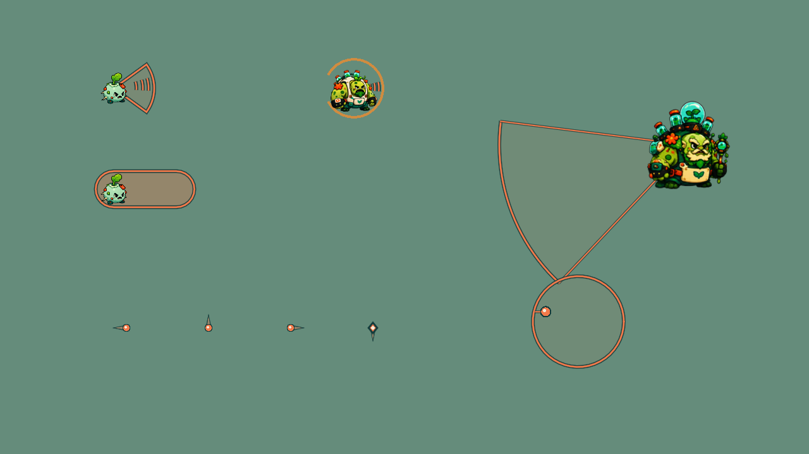
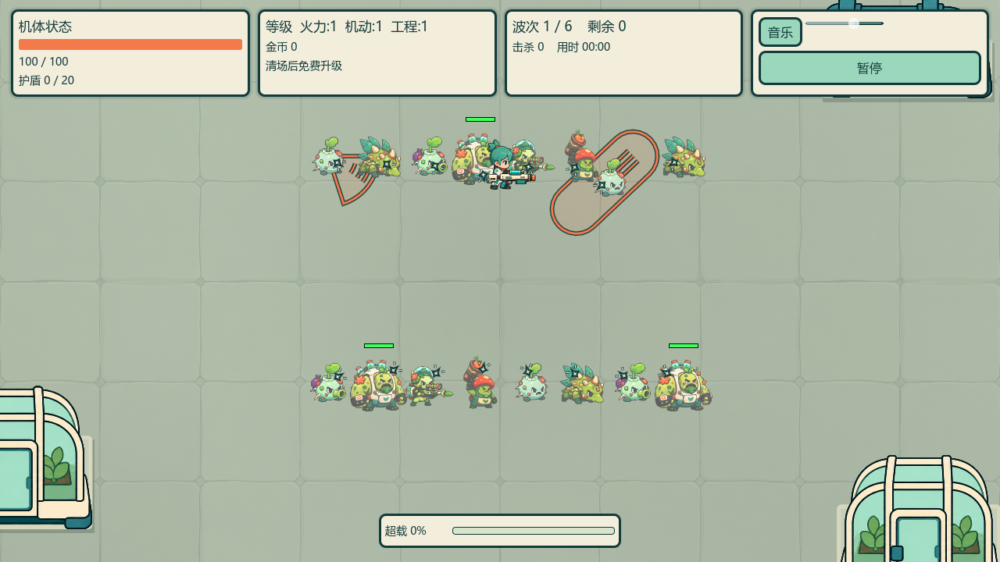

# Enemy feedback AB runtime review

2026-10-08 (Asia/Shanghai), branch `5分钟超载`.

Human style selection: **combine A and B**. Use A's sparse crisp directional strokes with B's compact cream core and dark-teal contour. The original A/B/C comparison remains a preview, never a production texture. These effects are native procedural drawing; no new raster asset or generated-image license approval is needed. Existing actor art/alpha/imports are unchanged. The art skill's gameplay-scale gate applies to this implementation.

## Slice 1 — actor-local incoming hit

Seven enemy kinds plus real OverseerBoss share one idle-disabled `EnemyHitFeedback` child per actor. Accepted damage drives a small contact star and two short ticks at the struck edge. Undirected damage keeps a center fallback. Impacts inherit actor movement and layer above their own body, without promoting ground decorations. Radius is 7px ordinary / 11px heavy; lifetime 100/140ms; local admission interval 65ms and one live impact. Parent free removes it, pause inheritance freezes it. Existing 80ms / 0.35 palette-preserving hit flash, real damage, health, camera/hit-stop/audio and global VFX caps are unchanged.

Evidence: new test failed with eight missing-feedback assertions against the original implementation. An intermediate inference error in the drawing loop was rejected by the strict runner, fixed with an explicit Vector2/float boundary, and retained under ignored `enemy-hit-ab-green-v1`. Subsequent isolated import and suites passed: EnemyHitFeedback81, EnemyReadability2576, BossReadability244, CombatFeedback48, EnemyDamageMultiplier63.

Native Vulkan controlled capture `build/diagnostics/enemy-feedback-ab/hit-v1`: real damage calls on 22 actor fixtures, bright/dark mint backgrounds and expiration checks; valid true, exit 0, no runtime errors. Viewed `hit-bright.png`: small outlined edge sparks remain legible without erasing actor shapes. This is actual 1280x720 rendering, but frozen fixture poses, not Main/input playthrough or performance/human acceptance.

Self-review across correctness, simplicity, architecture, security and performance: Critical0 / Required0 after the type fix. No new dependencies, events, persistent allocation per hit, gameplay range/timing changes, shader changes, or unrelated dirty-resource edits.

## Slice 2 — active attack strokes and hostile flight cues

Scrapper claw draws three outlined coral arc segments only in ACTIVE, with angle swept from the existing locked direction. Pounce draws at most three bounded speed lines behind the actual traveled position, inside its locked corridor. Active ground fill is reduced to 0x22 alpha, while the original warning polygon and 5/3px border are unchanged. Warning/recovery/cancellation have no attack strokes. Ordinary close melee uses the same drawing helper and a visual-only locked direction, without changing its hit calculation. Shared hostile bullets and Boss diamonds gain one small tapered trail behind the head, at most4.2 radii; player shots and stationary shots get no hostile trail. Lob flight has a short direction tick, and its existing 200ms broken impact rim gets a thin cream accent. Boss sweep retains the hose silhouette with a coral active center stroke. No new projectile, hit region, attack timing, muzzle event or particle-per-frame allocation is introduced.

Attack test: original code produced three intentional missing-feature failures; final EnemyAttackFeedbackTest803 assertions check four directions, five attack fractions, locked-domain containment, active/warning/recovery/cancel state, bounded stroke counts and hostile/friendly projectile separation. Existing Scrapper21, enemyDamage63, ProjectilePickup20, BossTentacle79, BossPattern265, ProjectileLandingVisual33, LobberVisualLifecycle68, GroundWarningLayer231, FriendlyEffectLayer33 also passed.

Added real pause test found the ALWAYS-processing Boss's inherited hit child expired during pause. Explicit tree-pause guard fixed it; EnemyHitFeedbackTest now82 assertions. This fix affects decoration only, not Boss attack clocks or processing policy.

Native `combined-v2` controlled fixture: 90 manually advanced 60Hz steps,45 encoded frame captures;7 claw ACTIVE steps,18 pounce ACTIVE steps and14 Boss sweep ACTIVE steps;48 simultaneous real damage actors with a visible Player. Bright/dark hit captures and expiry checks also pass. MP4 is encoded from those exact native PNGs at30fps, not an AI animation. Viewed mid-claw, mid-pounce and dense frames; no screen-filling burst, actor transparency, or oversized trail. This is a bounded fixture, not natural full-game input or a benchmark.

Controlled real Main scene capture `main-v3`: random obstacle map, normal player/HUD,16 accepted-hit enemies plus selected active claw/pounce states; synthetic incoming directions originate at the player. Actual native1280x720 screenshot viewed. Initial diagnostic `main-v1` leaked two pending objects during premature fixture teardown, rejected; existing SmokeTest's250ms audio-release wait makes subsequent captures error/leak-free. `main-v2` used an inverted synthetic incoming direction and is retained but superseded by `main-v3`; this was a diagnostic correction, not a production-code fix. No production audio/lifecycle code changed. Original user saves are not accessed for these runs: process APPDATA is isolated. This staged scene does not prove a normal-input playthrough, random obstacle navigation or full EXE combat acceptance.

Final full strict gate:85 Godot suites /174906 assertions and35 Python suites /269 tests, actual exit0, no timeout; retained under ignored `build/diagnostics/gameplay-feedback-v2/enemy-feedback-ab-full-v1`. Earlier failures remain retained rather than erased. Self-review: Critical0 / Required0 after pause/type corrections; unchanged damage, collision, AI, intervals, health, shader/body opacity, camera/audio/hit-stop. Package verification recorded separately in the v11 handoff.
