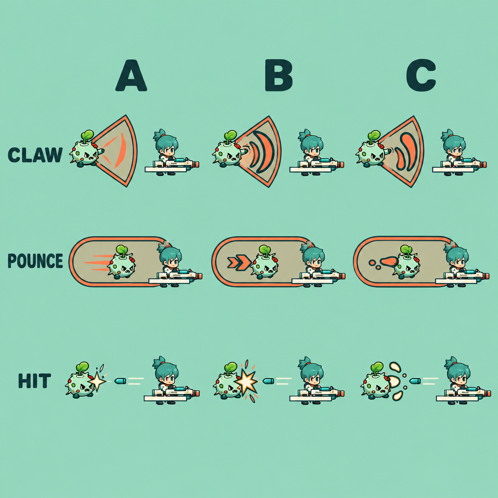

# Enemy attack / incoming-hit feedback: preview gate

Date: 2026-10-08 (Asia/Shanghai). Branch: `5分钟超载`. Inspected production baseline: `ed8807202d239798285117a00f90a5814fbea821`.

## Scope and current evidence

User request: improve enemy attack and hit effects. This batch interprets hit effects as enemies receiving player damage. Player damage-screen effects and audio are not changed. No changes to damage, attack timing, AI, collisions, warning shapes, movement, hit stop, or camera trauma are authorized by this visual batch.

Inspected `Enemy.gd`, `ScrapperAttack.gd`, `CombatFeedback.gd`, `CombatVfx.gd`, and `dasher_hit_flash.gdshader`, plus the prior native `locked-warnings.png` capture. Existing claw/pounce warning polygons correctly share the attack hit domain and must remain exact. Their active visuals chiefly change fill opacity. Accepted enemy damage uses an 80 ms, 0.35-strength palette-preserving flash. Generic sparks originate at the reported enemy center and move with incoming direction; this can make the visible contact feel detached from the actual struck edge. Friendly decorative effects deliberately remain on the ground, with existing global/local caps to avoid obscuring threats. Do not indiscriminately promote all effects above actors or restore full-body whiteout.

## Comparison

| Direction | Attack | Incoming hit | Tradeoff |
| --- | --- | --- | --- |
| A: crisp slash | Tapered coral strokes; sparse pounce speed ticks | Small cream contact spark | Least clutter, but thin strokes need actual-scale contrast checks |
| B: outlined comic | Chunky coral crescents and short directional chevrons | Compact outlined cream impact star | Recommended for readability; reduce the concept's oversized burst at runtime |
| C: bio impact | Rounded coral lobes and sparse droplets | Rounded chips and localized ripple | Fits bio-farm, but must not resemble pickups or lingering damage areas |

The prompt library was refreshed and searched in game-asset, others, and comic-storyboard categories. No suitable compact 2D chibi enemy-attack/hit template matched this project's palette and camera. The image therefore uses an original custom prompt, not a remixed community template. Generation used built-in `image_gen`; no CLI/API credentials used.

## Review and limitations

Generated file inspected inline: 1254x1254 RGB, fully opaque comparison background. SHA-256: `f9214e833f0dd258695ce89367220f6ba6930196b4bc5c8af109f64463de5dc8`. Generator returned a larger size than requested; the manifest records actual dimensions, rather than claiming an exact 1024 output.

The three columns show different slash, movement, and contact shapes using the current palette. Warning borders remain visible in the concept; B has the clearest small-shape outline. This is enlarged AI-generated concept art, NOT an in-engine screenshot, timing validation, production sprite sheet, unchanged-character proof, or gameplay-scale approval. It contains slight reference-character redraw variations and cannot be imported directly. Background/body opacity here does not prove the alpha of any future isolated effect texture.

Status: **preview; human selection pending**. No production file, gameplay code, registry approval, or current playable package changed. The proposed `runtime_path` is reserved only; no comparison board exists under that path. Preserve unrelated dirty files.

## Implementation after selection

1. Retain precise ground warnings as the authoritative geometry. Add active-only claw traces and pounce streaks driven by the real attack stage/direction; never introduce a misleading extra hit area or change attack durations.
2. Anchor accepted-hit shapes to the contacted enemy edge when a valid incoming direction exists; retain safe center fallback for undirected damage. Differentiate ordinary hit, heavy hit, and death through bounded size/lifetime, not more camera shake.
3. Keep faction colors and actor opacity. Use compact outlined hit shapes rather than washing the enemy white. Sustained laser/burn damage must have local temporal caps; a rejected damage event must emit nothing.
4. Reuse bounded procedural drawing where it can reproduce the chosen style accurately. Only generate separate transparent textures if procedural shapes cannot meet the approved look; each new asset requires a separate manifest/alpha review.
5. Extend existing real-event and bounded-cap tests first. Verify locked warnings/hit domains, accepted/rejected damage, cancellation/death, dense-fight occlusion, layering, pause/restart cleanup, and unchanged damage/timing. Capture actual-scale animated enemy claw/pounce, ranged discharge/landing, Boss attacks, incoming hit and death before declaring runtime acceptance.

The requested optimization remains unfinished until selection, implementation and runtime verification. This preview commit is only a completed design checkpoint; it is not a public release or a new playable build.
