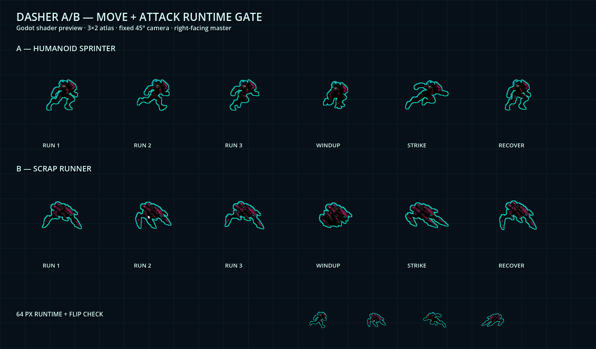

# Dasher A/B 移动与攻击动作 v1

日期：2026-08-18

## 自主审批结论

批准 A/B 两套动作图集进入 `5分钟超载` 运行时，状态为 `gameplay-approved`。授权仍为 `pending`，因此不标记为 `final`。

## 选择结果

- 每个变体使用一张 3×2、1536×1024 RGBA 图集，每格 512×512。
- 上排三帧构成 `0→1→2→1` 的 9 FPS 移动循环。
- 下排依次为蓄力、冲击、恢复，由既有 `attack_timer` 驱动。
- 继续使用单一右向母图和运行时水平翻转，不制作重复的左向资源。
- A 保留人形战术冲刺者身份；B 保留低伏反关节机械体身份。

## 生成与修复

- 使用内置 imagegen，以既有 A/B 正式资源为身份参考、style lock A 为渲染语言参考。
- imagegen 输出为 1536×1024 RGB，并把透明棋盘格画进背景，未直接通过。
- `remove_connected_light_background.py` 仅移除与画布边缘连通的高亮中性背景，保留封闭在深色轮廓内的白色装甲细节。
- `repack_animation_sheet.py` 从透明图中识别六个连通主体，使用统一缩放比例重新装入严格 512×512 网格，解决 A 冲击帧跨格问题。
- RGB 原始输出与透明化中间文件保存在 `assets/art/source/enemies`；只有重新打包后的两张图集进入 `assets/art/actors/enemies`。

## 运行时接入

- `Enemy.gd` 使用新 A/B 动作图集和 `Sprite2D.hframes=3`、`vframes=2`。
- 运行时缩放为 `0.125`，每帧显示尺寸为 64×64。
- 移动、蓄力、命中和恢复只改变视觉帧，不修改碰撞、速度、生命、伤害、AI 或攻击计时。
- 每个实例按稳定的实例标识获得移动循环相位偏移，降低敌群动作完全同步的机械感。
- Dasher 共用一份编译 Shader；每个实例保留独立闪白参数。
- 打包器在图集中预烘约 1px 的青色 Alpha 外轮廓，使深色主体在战场网格上仍可读；运行时 Shader 不做邻域采样。

## 证据

- 动作板由 Godot 4.7 OpenGL Compatibility 后端真实渲染，尺寸 1536×900。
- 大尺寸行覆盖 A/B 全部六帧；底部覆盖 64px 实际尺寸和左右翻转。
- `EnemyDasherArtTest`：27 项断言通过。
- `test_dasher_action_assets`：验证 RGBA、1536×1024、透明四角、六格非空和至少 24px 安全边距。

## 后续观察

- A/B 的动作幅度已足以在 64px 下区分移动、蓄力与冲击。
- 深色装甲内部细节在 64px 下仍会压缩，但青色轮廓保证威胁轮廓清楚；暂不继续整体提亮，以免破坏项目低亮度材质层级。
- 外轮廓从运行时 8 邻域采样改为离线预烘，极端 250 只同屏时避免每帧约 820 万次额外纹理采样。
