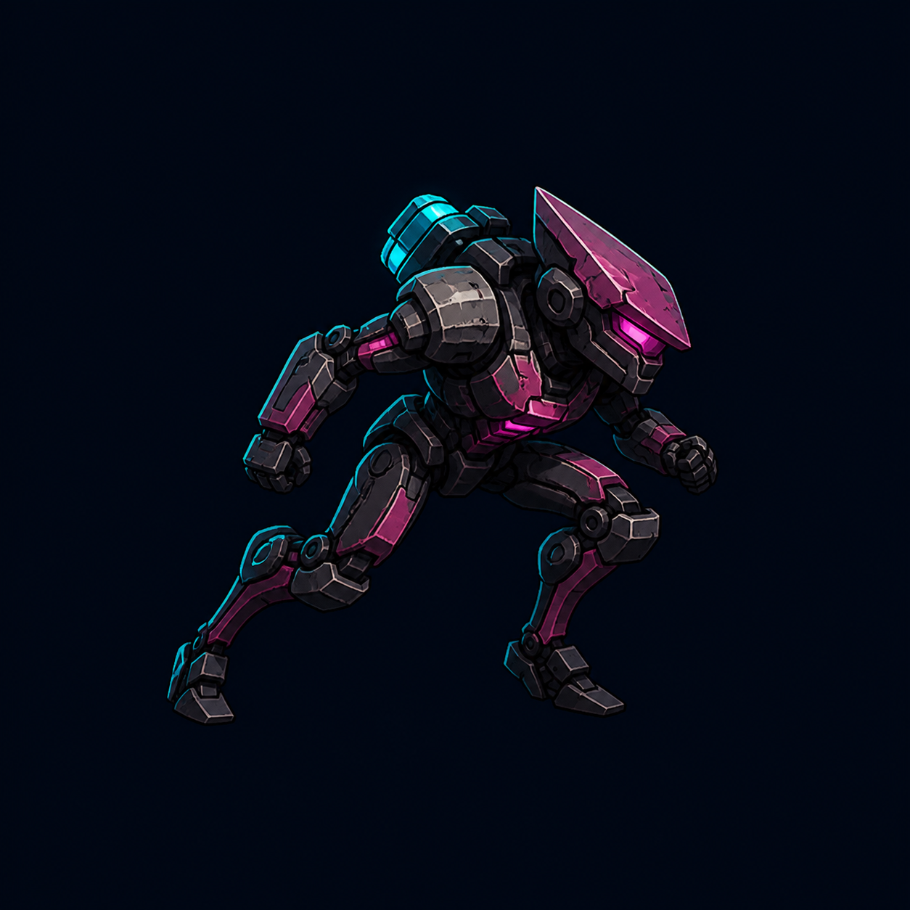
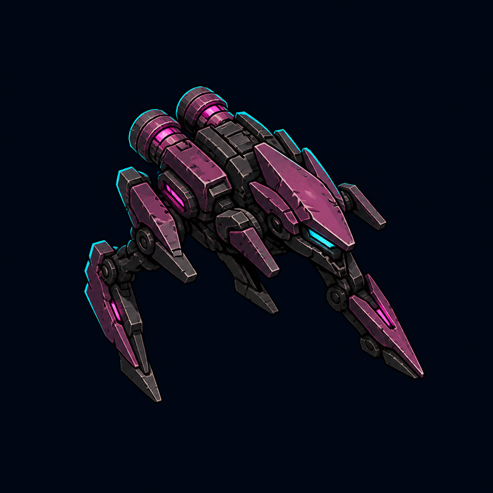
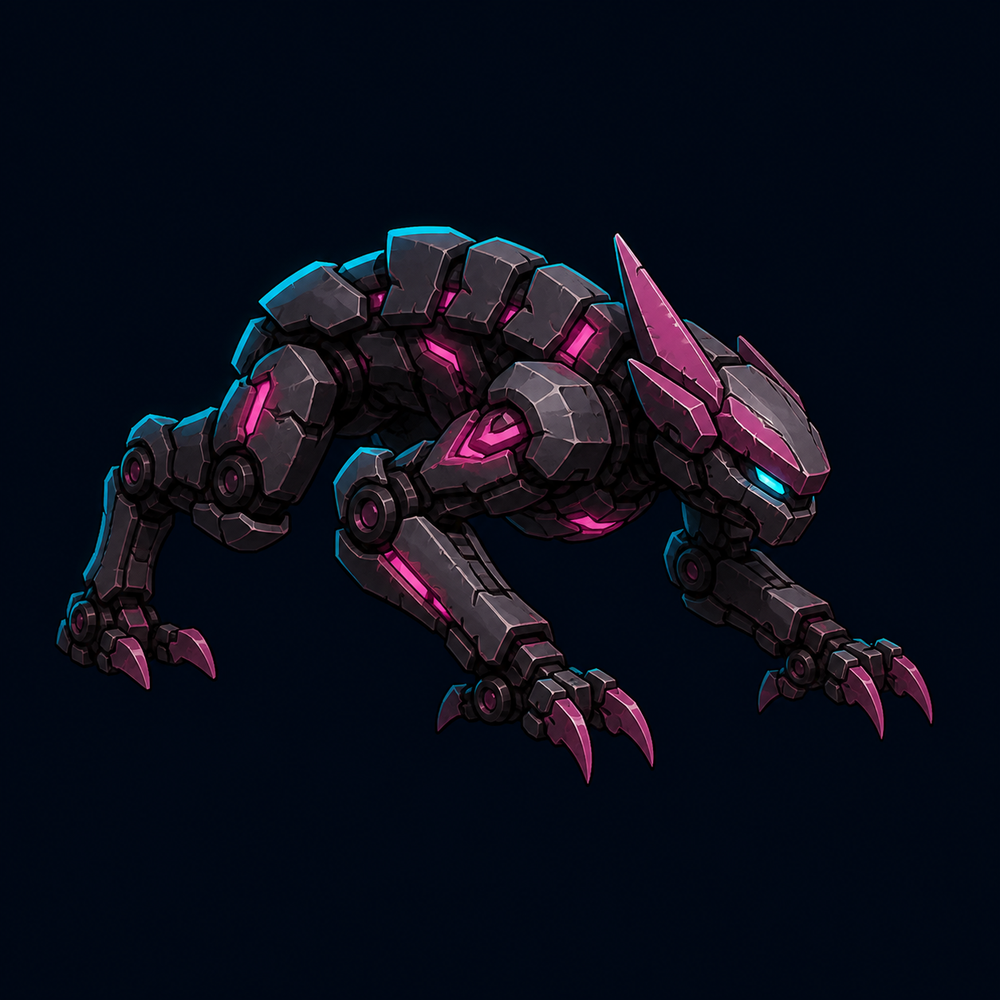
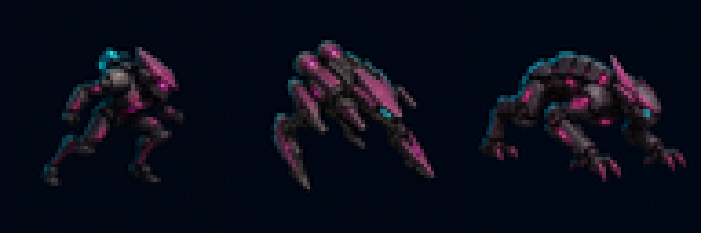

# ART-3C：Dasher 造型预览第一轮

## 状态

- 全局风格：继承用户已批准的 A（战术图形插画），本轮不重新决定整体画风。
- 当前门：等待用户从 Dasher 的 A/B/C 三种轮廓中选择。
- 资源状态：`preview`；所有图均为黑蓝背景 RGB 预览，不是透明运行时成品。
- 授权状态：`pending`，不得标记为 `final`。

## 固定合同

- 玩法角色：速度 145 px/s 起、22 基础生命、14 px 标准敌人碰撞半径。
- 运行时目标：64×64；只制作一张面向右方母图，玩家位于左侧时水平翻转。
- 固定视觉：俯视三分之四镜头、敌方洋红主色、青色受控轮廓光、深色磨损装甲。
- 固定禁项：不改变碰撞或数值；不使用动态拖尾、武器、文字、边框和场景背景。

## 方案

### A：战术疾行兵

紧凑人形、前倾姿态、楔形头盔、长冲刺腿和背部小型蓄能器。与现有 Scrapper 的人形语言最接近。

### B：废铁疾行机甲

低伏机械底盘、双推进器、反关节支腿和尖锐前向轮廓。64×64 下速度辨识度最强，也最容易与普通人形敌人区分。

### C：生化机械猎兽

四足扑击轮廓、装甲脊背和机械利爪。形体最有压迫感，但缩小后更接近重型单位。

## 64×64 检查

从左到右依次为 A、B、C，均由各自源预览直接缩小后以最近邻放大展示：

检查结果：三种轮廓在 64×64 可区分；没有文字、边框或裁切。正式资源仍需在选型后执行透明背景、枢轴、翻转、受击闪白和 Godot 实战验收。
