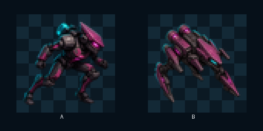
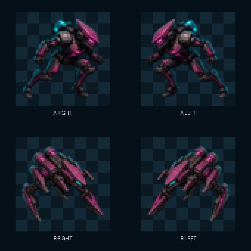

# ART-3C：Dasher A/B 正式资源 v1

> 2026-08-10：撤销 gameplay approval。用户选择的 A/B 设计身份继续保留，但当前只有静态翻转，没有移动、攻击、受击和死亡动画，也没有严格 45°运行时证据。

## 结果

- 用户选择：同时保留 A 和 B；C 不进入正式制作。
- A 路径：`res://assets/art/actors/enemies/enemy_dasher_a.png`。
- B 路径：`res://assets/art/actors/enemies/enemy_dasher_b.png`。
- 两张母图均为 1024×1024 RGBA；运行时目标均为 64×64。
- 两张均固定朝右；当玩家位于敌人左侧时由运行时水平翻转。
- 本轮没有修改 Dasher 的碰撞、速度、生命、伤害或 AI。

## 生成与透明化

- 生成方式：内置 `imagegen`，以已批准预览和项目 style lock 为参考。
- 透明方式：生成绿色键控源图后，使用标准 `remove_chroma_key.py` 柔和蒙版与去色处理。
- 透明主体统一裁切到 1024×1024 画布，并保留约 7% 外边距。
- 授权状态仍为 `pending`，因此不得标记为 `final`。

## 64×64 实际尺寸检查

- A：保留紧凑人形、楔形头盔和长冲刺腿，64×64 下仍可辨认。
- B：保留低伏底盘、双后置推进器和刀刃腿，64×64 下与人形敌人区分明显。

## 水平翻转检查

翻转后 A、B 均保持完整轮廓，没有文字、非对称武器或方向性特效造成语义错误。

## 像素验证

| 资源 | 模式与尺寸 | 非透明边界 | 四角 Alpha | 键控绿残留 |
|---|---|---|---|---|
| A | RGBA 1024×1024 | `(72, 78)–(952, 945)` | 全部为 0 | 2 / 336984，可忽略且目视不可见 |
| B | RGBA 1024×1024 | `(72, 102)–(952, 921)` | 全部为 0 | 0 / 301949 |

## 当前审查状态

两张资源已通过选型、风格一致性、透明边缘、64×64 轮廓、水平翻转检查和 Godot 4.7 无界面导入。

## 运行时接入

- `Enemy.gd` 在生成 Dasher 时从 A/B 两张母图中选择一种，并创建线性过滤的 `Sprite2D`。
- 1024×1024 母图按 `0.0625` 缩放到 64×64 运行时画布，视觉中心与现有 14 px 圆形碰撞中心重合。
- 玩家位于敌人左侧时设置 `flip_h`，位于右侧时恢复朝右母图。
- 受击沿用现有 0.08 秒 `flash_timer`，通过独立 CanvasItem shader 将贴图混合为白色；结束后自动恢复。
- Dasher 使用贴图后不再绘制旧的程序化方块身体，但近战攻击范围提示继续保留。
- A/B 仅改变视觉，不改变碰撞、速度、生命、伤害、经验或 AI。

## 自动验收

- `EnemyDasherArtTest`：17 项断言通过，覆盖资源存在、1024×1024 尺寸、64×64 缩放、A/B 切换、线性过滤、14 px 碰撞、速度、伤害、左右翻转和受击闪光。
- 完整 Godot 测试：14 个测试套件、80,451 项断言全部通过。

原有自动测试只能证明静态贴图接入、翻转和闪白，不能证明动画或实际战斗表现。A、B 现降为 `draft`，完成新动画与运行时证据门前不得恢复审批。
