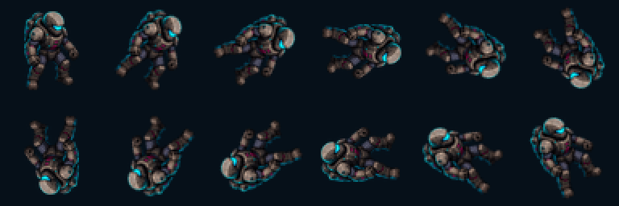
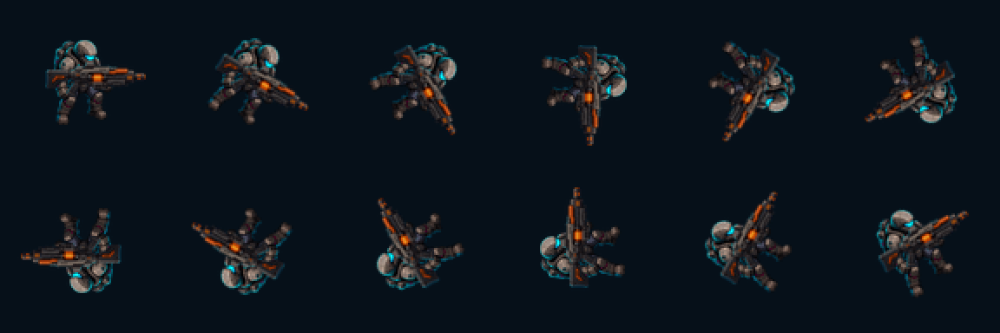
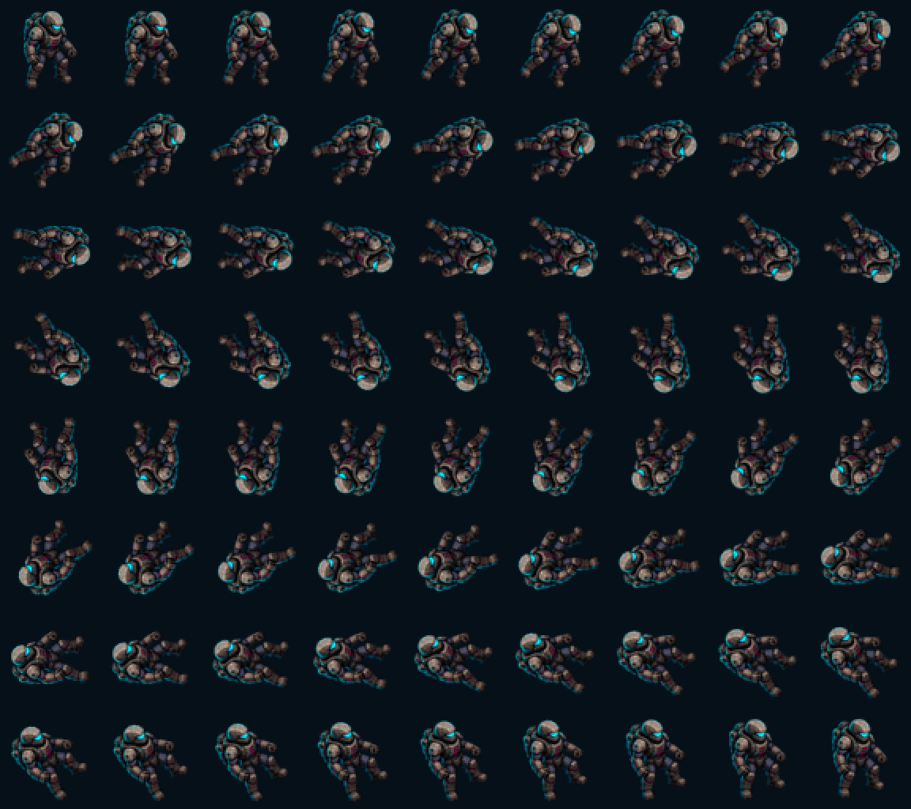

# ART-3A：玩家 72 帧射击朝向 v1

> 2026-08-10：本方案因屏幕平面旋转造成错误转身观感而被否决，仅保留作历史对照，不得回到生产审批。

## 状态

- 风格继承：用户已批准的 A（战术图形插画）。
- 资源审查：`draft`。
- 玩法审查：角度映射自动测试通过；最终密集战斗可读性仍待用户和游戏内验收。
- 授权审查：`pending`，不得标记为 `final`。

## 数量与角度合同

- 完整角度：360°。
- 步长：5°。
- 帧数：`360 / 5 = 72` 张独立 PNG。
- 命名：`angle_000.png` 至 `angle_355.png`。
- 排列：9 列 × 8 行，按角度顺时针、行优先写入图集。
- 运行时：玩家机体选择最接近射击角度的帧；独立主武器仍连续旋转。

## 运行时预览

每隔 30° 抽取一帧：

机体与独立武器组合抽样：

全部 72 帧：

## 资源与谱系

- 批次目录：`../../../assets/art/actors/player/directions/`。
- 运行时图集：`../../../assets/art/actors/player/player_directional_atlas.png`，576×512 RGBA。
- 母图：`../../../assets/art/actors/player/player_base.png`，1024×1024 RGBA。
- Manifest：`../manifests/characters-combat/player_directional_atlas.production-v1.json`。
- 构建器：`../../../scripts/art/build_player_directional_atlas.py`。
- 生成方式：从同一批准母图确定性裁切、缩放和旋转，不使用逐帧 AI 重画。

## 敌人临时朝向规则

- Scrapper、Dasher、Spitter 与 Bruiser 当前每类只制作一张面向右方的透明母图。
- 玩家位于敌人左侧时设置水平翻转；玩家位于右侧时使用原图，使敌人保持面朝玩家。
- 该规则只改变视觉朝向，不改变碰撞、移动、攻击范围或伤害。

## 验证范围

- `PlayerDirectionalArtTest` 检查 72 个精确文件名、每 5° 映射、负角度与 360° 回绕、图集尺寸和首尾帧矩形。
- 生成器从母图重新构建全部帧，避免累计旋转误差。
- 每帧固定 64×64 RGBA；旋转主体最大对角线限制为 60 px，避免任意角度裁切。
- 当前表现属于屏幕平面旋转，保留批准母图的身份与材质一致性；没有引入新的风格决定。
