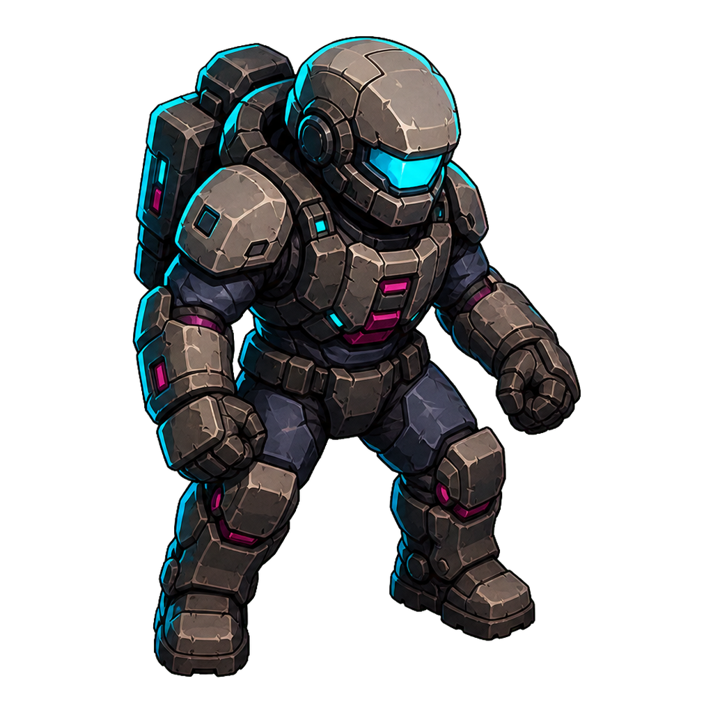
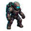
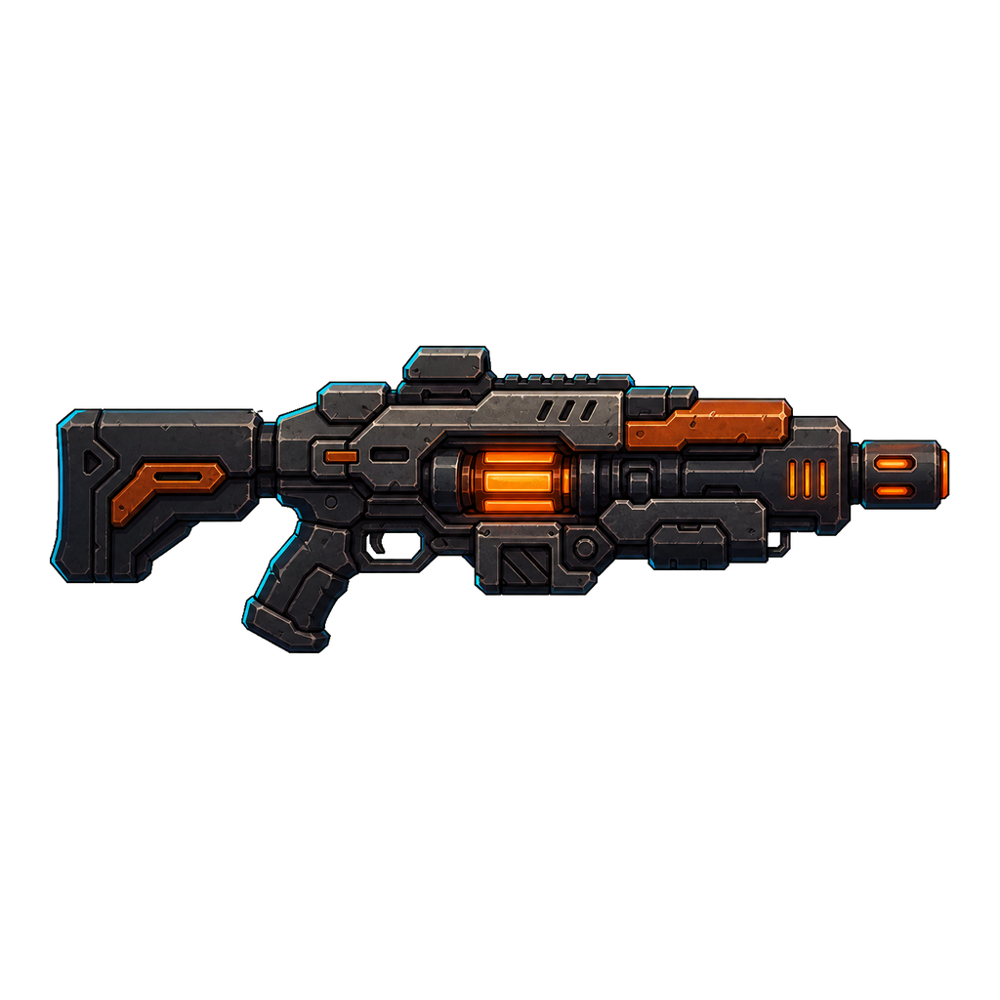
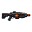
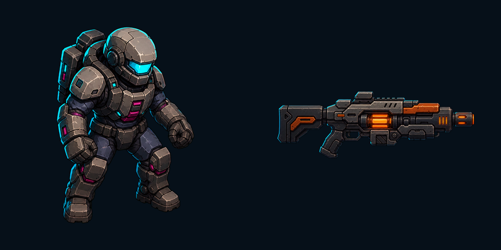
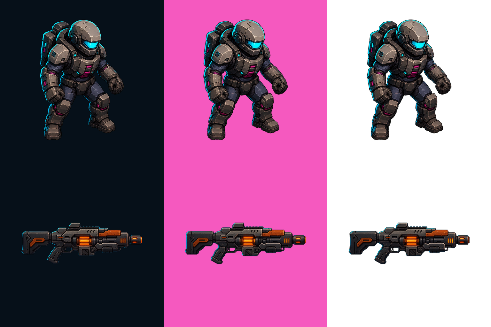

# ART-3A：玩家机体与独立主武器候选 v1

> 2026-08-10：本审查已被技术与视觉复盘否决。机体设计身份可作参考，但镜头、武器投影、socket 和运行时分层均需重新验证。

## 状态

- 批次：`ART-3A`
- 风格继承：用户已批准的 A（战术图形插画）
- 当前审查：`draft`
- 玩法审查：待用户确认外观后接入实际战斗，再进入 `gameplay-approved`
- 授权审查：`pending`；不得标记为 `final`

## 候选资源

### 玩家机体

- Asset ID：`player_base`
- Manifest：`../manifests/characters-combat/player_base.production-v1.json`
- 运行时路径：`res://assets/art/actors/player/player_base.png`
- 要点：不包含武器；视觉中心与 13 px 碰撞中心对齐；友方青为主色。

64×64 检查：

### 独立主武器

- Asset ID：`player_weapon`
- Manifest：`../manifests/characters-combat/player_weapon.production-v1.json`
- 运行时路径：`res://assets/art/actors/player/player_weapon.png`
- 要点：枪口向右、水平中心线稳定，供运行时独立旋转；武器橙为高优先级功能色。

64×64 检查：

## 并列预览与透明边缘检查

透明边缘分别在黑蓝、洋红和白色底上检查：

## 技术检查

- 两张正式资源均为 1024×1024 RGBA PNG，四个角的 alpha 均为 0。
- `player_base` 非透明边界为 `(190, 51)–(834, 973)`；`player_weapon` 为 `(51, 354)–(973, 669)`。
- 色键残留检测：两张资源中 `alpha > 16` 且接近纯绿色的像素均为 0。
- 玩家机体与武器在 64×64 缩小图中仍保留轮廓、友方青和武器橙职责。
- Godot 4.7 无界面编辑器导入成功，未报告 PNG 导入错误。
- 尚未替换程序化 `_draw()`，因此枢轴、遮挡顺序、受击闪白和高密度战斗表现仍待后续游戏内验收。

## 生成与后处理谱系

- 生成方式：内置 `imagegen`，分别生成机体和武器；未使用批量变体或 CLI 模型。
- 风格参考：`../previews/characters-combat/style-lock-a-v1.png`。
- 提示词来源与约束：完整记录在两个 production manifest 中。
- 透明流程：均匀绿色色键 → 项目安装的 `remove_chroma_key.py` 自动取边框色、软蒙版与去溢色 → 归一到 1024×1024 → 生成 64×64 检查图。

## 下一决策

- 若用户批准本套玩家机体与武器外观，继续制作 Scrapper、Dasher、Spitter 与 Bruiser。
- 若只需调整枢轴、留白、边缘或缩小可读性，可在已锁定风格内修订。
- 若要改变机体形体语言、材质、色板、镜头或共享照明，重新开启三方向风格预览门。
