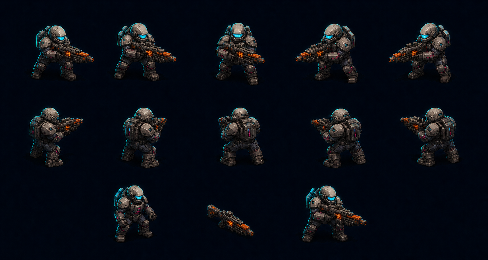
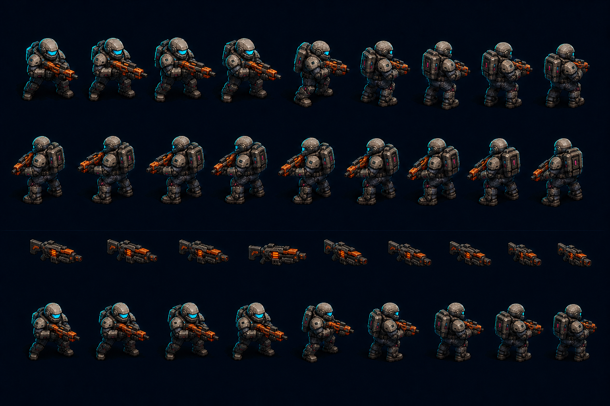
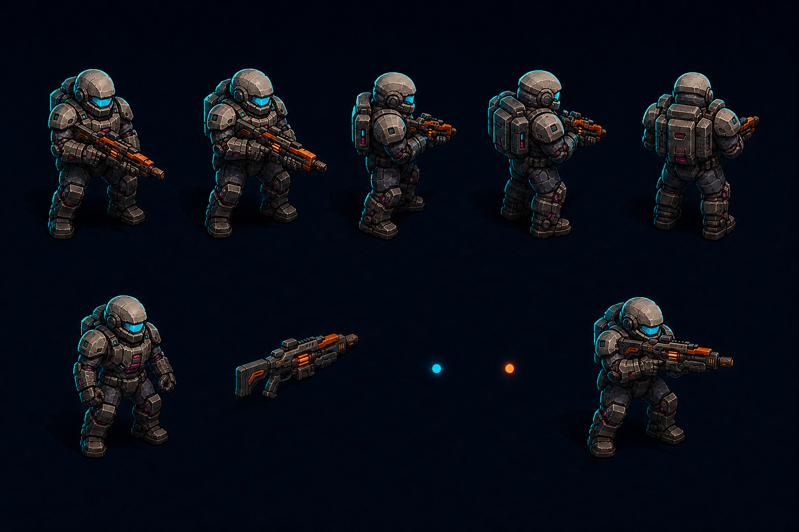

# 玩家 45°视觉管线技术预览：第一轮

## 状态

- 总体风格：沿用已批准的 A 战术图形插画，不重新选择美术风格。
- 技术状态：`preview`，等待用户选择 A/B/C。
- 三张图均为内置 `imagegen` 生成的技术概念板，不是可切分的生产帧。
- 数学上严格 45°、方向间隔、Alpha、socket 和动画一致性必须在选定方案后由 Godot 相机与统一 rig 确定性保证。

## 共同合同

- 严格 45°俯视正交相机；角色只绕世界竖轴旋转。
- 玩家身体与枪械分开，但共享 rig、相机、方向和照明。
- 双手握持，枪托靠近肩部，枪口使用独立 socket。
- 根据朝向切换 behind/body/front 遮挡，不允许侧视枪械在屏幕平面旋转。
- 角色主体完全不透明；只有抗锯齿边缘允许部分 Alpha。
- 预览选择完成前不批量生成 idle/run/fire/dash/hit 正式帧。

## A：16 方向预渲染

- 每方向间隔 22.5°，运行时只查表和播放 2D atlas，工程风险最低。
- 8 帧移动循环的身体原始 RGBA 预算约 2 MiB；16 张独立武器方向帧约 0.25 MiB。
- 概念板已显示前、侧、背结构和身体/枪械/合成分层；生成器多给了采样视图，不代表正式帧数。
- 风险：在慢速瞄准和近水平/垂直边界处，22.5°跳变可能可见。

## B：24 方向预渲染

- 每方向间隔 15°，方向过渡更细，仍保持纯 2D atlas 的稳定运行成本。
- 8 帧移动循环的身体原始 RGBA 预算约 3 MiB；24 张独立武器方向帧约 0.375 MiB。
- 概念板清楚分开身体、同方向枪械和最终合成；少数背向枪械细节仍有概念生成漂移，正式资源不能直接从本图切片。
- 成本比 A 高 50%，但在 64×64 尺寸下仍处于可控范围。

## C：实时 2.5D rig

- 单一模型连续旋转，不受方向帧数量限制；手部、枪口、遮挡和后坐最自然。
- 不需要为每个动作乘以方向数，但需要可靠的模型、UV/材质、骨骼、动画和 Godot 3D→2D 合成路径。
- 概念板明确展示了身体 rig、独立枪械、手部/枪口 socket 和最终装配。
- 风险最高：需要验证 SubViewport/3D 合成的帧时间、缩放清晰度、2D z-order 和与其他 2D 敌人的风格一致性。

## 对比与建议

| 方案 | 转向步长 | 动画资源量 | 运行时风险 | 制作风险 | 适合当前项目 |
|---|---:|---:|---:|---:|---|
| A | 22.5° | 低 | 低 | 低 | 最稳妥，但可能看出跳向 |
| B | 15° | 中 | 低 | 中 | **推荐：平滑度与资源量最均衡** |
| C | 连续 | 取决于模型/纹理 | 中 | 高 | 长期上限最高，当前改造面最大 |

建议选择 B。它能解决当前 3°×120 帧浪费问题，又不会把项目立刻改造成混合 3D 渲染；玩家独占约 3 MiB/8 帧动作的原始方向数据是合理投入。若后续 64×64 实机片段证明 A 已足够平滑，可在正式批量生产前降到 A；C 只在愿意承担 3D rig 与运行时合成验证时选择。

## 提示词来源

- Sci-Fi Tactical Soldier Character Sheet（YouMind ID 27303）：多角度战术轮廓写法。
- Consistent Three-View Character Sheet（YouMind ID 26830）：正/侧/背身份一致性写法。
- Photoreal Character Reference Sheet（YouMind ID 13285）：严格多面板与禁止视图漂移写法。

以上只用于提示词结构；项目 A 风格、角色身份、45°相机和分层合同优先。

提示词由 [YouMind.com](https://youmind.com) 通过公开社区搜集 ❤️
