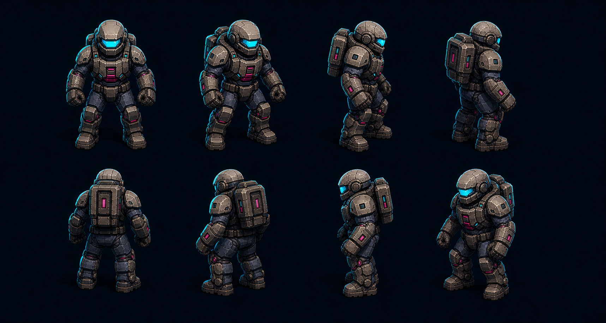
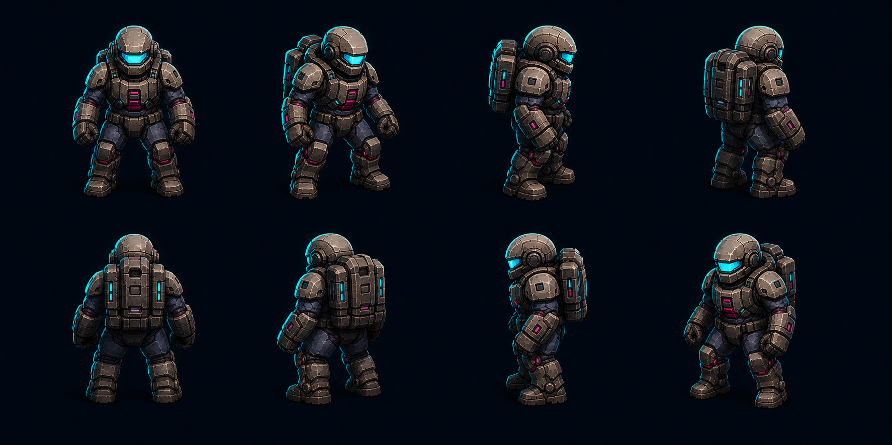
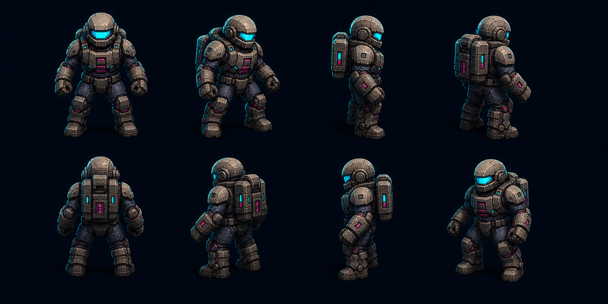
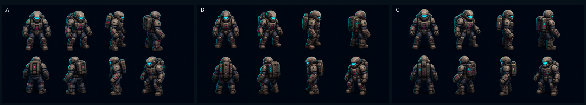

# 玩家真实多视角转身：预览轮次 1

## 目标合同

- 固定俯视三分之四正交镜头与画面重力方向。
- 玩家始终直立，只绕角色竖直轴改变 yaw 朝向。
- 预览必须能辨认正面、左右侧面、背面及四个斜向视角。
- 正式资源目标为完整 360°、每 5° 一帧，共 72 帧。
- 角色机体与独立武器分层；武器继续按实际射击角度旋转。
- 旧版屏幕平面旋转图集保留为回退资源，直至新版本完成游戏内验收。

## 待选制作路线

| 方案 | 管线 | 优点 | 主要风险 |
|---|---|---|---|
| A（推荐） | 卡通渲染 3D 模型转台 | 72 帧几何、比例和装甲结构最稳定，可重复渲染任意角度 | 需要先完成角色建模、材质和卡通渲染风格匹配 |
| B | 纯 2D 手绘多方向 | 最接近批准的 A 战术图形插画笔触 | 72 帧成本最高，补间视角容易出现身份和结构漂移 |
| C | 3D 底模 + 2D 绘制 | 在稳定体积与插画质感之间折中 | 需要建立批量绘制规则，否则逐帧修饰仍可能闪烁 |

## 预览状态

- 三份生成清单已建立并通过 manifest 校验。
- 2026-08-04 已生成每个方案各一张 4×2 八方向真实转身板；没有提前生成完整 72 帧。
- 三套预览均保持角色直立，并能辨认正面、左右侧面、背面与四个斜向视角，没有用屏幕平面旋转冒充转身。
- 运行时缩尺对比中，三套方案的朝向与玩家青色识别色仍可读。
- 这些图片用于比较目标外观与制作路线，不代表已完成可重复渲染的生产模型；正式制作仍须建立稳定模型或多视角母版。
- 当前等待用户选择 A、B 或 C；未获选择前不得开始正式 72 帧制作。

## A：卡通渲染 3D 模型转台（推荐）

## B：纯 2D 手绘多方向

## C：3D 底模 + 2D 绘制

## 运行时缩尺对比

从左至右为 A、B、C：

