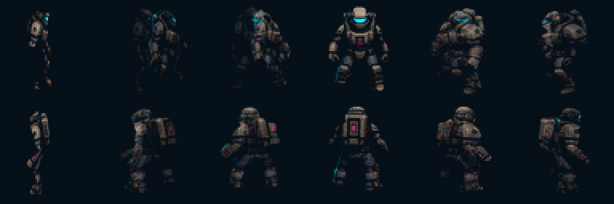

# ART-3B：玩家 120 帧真实转身 v1

> 2026-08-10：本方案已被否决。实际相机俯角约 25.6°，投影着色器用亮度推导 Alpha，且运行时枪械仍为侧视贴图二维旋转；原 gameplay approval 无效。

## 状态

- 风格：用户已批准 A（战术图形插画）。
- 资源审查：`draft`；等待严格 45°相机、正确 Alpha、武器 socket 和实际战斗片段重新验收。
- 授权审查：`pending`；Hunyuan3D 2.1 相关授权条款尚未完成项目方复核，因此不得标记为 `final`。

## 数量与方向合同

- 完整角度：360°；步长 3°；共 120 帧。
- 命名：`angle_000.png` 至 `angle_357.png`，角度严格为 3 的倍数。
- 图集：12 列 × 10 行，768×640 RGBA，按角度顺时针、行优先排列。
- 基准方向：0° 右侧、90° 正面、180° 左侧、270° 背面。
- 运行时：玩家机体选择最接近射击角度的帧；独立武器继续按实际射击角度连续旋转。

## 运行时预览

每隔 30° 抽取一帧：

## 制作方式与资源占用

- 所有帧由同一个 200,179 顶点、400,356 三角面的稳定 GLB 模型旋转得到，不使用 120 次独立生成。
- 用户批准的八个关键视图先对齐到模型投影，再在相邻 45° 视图间连续混合；模型负责真实前、后、侧轮廓与遮挡变化。
- 运行时只加载 768×640 图集，不加载 GLB、投影母图或生成环境；多渲染角度不会增加运行时节点、AI 推理或 3D 渲染开销。
- 旧 72 帧平面旋转资源继续保留为回退版本，本次不删除。

## 谱系与验证

- 运行时图集：`../../../assets/art/actors/player/player_turnaround_atlas.png`。
- 独立帧：`../../../assets/art/actors/player/turnaround_directions/`。
- 稳定模型：`../../../assets/art/source/player/player_turnaround_model_v1.glb`。
- 八视图投影：`../../../assets/art/source/player/player_turnaround_projection_atlas_v1.png`。
- Manifest：`../manifests/characters-combat/player_turnaround.production-v1.json`。
- `PlayerTurnaroundModelTest` 验证模型可导入及几何数量；`PlayerDirectionalArtTest` 验证 120 个文件名、3° 映射、角度回绕、图集尺寸、透明边角和基准方向差异。
