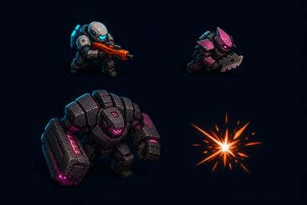

# 角色与战斗风格预览：第一轮

## 状态

- 风格门：`Checkpoint ART-A`
- 当前状态：用户已选择并批准修正后的 A 风格锁定稿；ART-3 可以在锁定风格内制作
- 可选方向：`A`、`B`、`C`，也可指定组合特征或要求新一轮预览
- `review_state`：`style-approved`
- 禁止事项：不得偏离已批准的镜头、材质、轮廓语言、色板和照明；实质风格变更必须重新提供 A/B/C 预览

## 固定比较条件

- 内容：玩家、Scrapper、Bruiser、基础命中火花。
- 布局：左上玩家、右上 Scrapper、左下 Bruiser、右下命中火花。
- 镜头：俯视三分之四视角。
- 阵营色：玩家青、敌人洋红、玩家武器和命中橙。
- 目标尺寸：标准角色约 64×64，Bruiser 约 96×96。

## A：战术图形插画

- 优势：轮廓最干净，装甲分面和阵营色清晰，小尺寸最稳。
- 取舍：质感较规整，废土拼装感和磨损层次较少。
- Manifest：`../manifests/characters-combat/player_base.preview-a.json`

## B：废土手绘工业

- 优势：氧化、积尘、织物和修补痕迹最丰富，废土感最强。
- 取舍：小尺寸下内部纹理较密，需要在正式稿中主动删减细节。
- Manifest：`../manifests/characters-combat/player_base.preview-b.json`

## C：微缩 PBR 模型

- 优势：立体体块、磨损材质和小尺寸轮廓较均衡，Bruiser 体量感最好。
- 取舍：若继续提高高光或真实感，可能滑向过度光滑的模型展示风格。
- Manifest：`../manifests/characters-combat/player_base.preview-c.json`

## 缩小对比

此图将每张 1536×1024 预览缩至 384×256，用于检查接近运行时尺寸时的轮廓和色彩层级。

## 已发现问题

- 三个方向的 Scrapper 都被生成成持枪单位，与当前近战追击玩法不一致。
- 本轮只用于选择材质、体块、光照和细节密度，不批准具体装备设计。
- 用户选择方向后，下一张风格锁定稿必须将 Scrapper 改为无枪、短程近战、前向追击轮廓。
- 当前预览为不透明背景的风格板，不代表最终透明 PNG 已完成。

## 参考谱系

本轮只把以下公开示例作为构图或材质提示参考，未把它们作为项目风格权威：

- A：`Sci-Fi Tactical Soldier Character Sheet`，YouMind prompt `27303`。
- B：`Archive Recovery Operative Character Sheet`，YouMind prompt `25446`。
- C：`Hyper-Realistic 3D CGI Collectible Figurine Prompt for Nano Banana 2`，YouMind prompt `12837`。

完整生成提示词、示例图 URL、负面约束和模型记录在对应 manifest 中。

## 用户决定

- 选择：A，战术图形插画
- 保留特征：干净外轮廓、清晰装甲分面、克制的手绘赛璐璐明暗、玩家青/敌人洋红/武器橙的职责分离、Bruiser 的明显体量层级
- 拒绝特征：Scrapper 持枪、敌方远程装备误导、过多微细节、过量 bloom
- 需要重做：以 A 为参考生成一张修正后的最小风格锁定稿；Scrapper 必须是无枪近战追击单位，Bruiser 不得持枪

## A 风格锁定候选 v1

运行时缩小检查：

- Manifest：`../manifests/characters-combat/player_base.style-lock-v1.json`
- 保留：A 的战术图形插画、干净分面、克制赛璐璐明暗、青/洋红/橙职责分离。
- 修正：Scrapper 改为短刀近战追击单位，不再持枪；Bruiser 只保留盾臂和重拳。
- 缩小检查：玩家、Scrapper 和 Bruiser 的轮廓及体量层级可辨；基础命中火花保持最高瞬时亮度。
- 技术状态：预览为 1536×1024 RGB 不透明风格板，不代表最终透明运行时 PNG。
- 审查状态：`style-approved`；用户于 2026-08-04 明确回复“批准”。

## 最终审批记录

- 审批结果：批准 A 风格锁定候选 v1。
- 锁定范围：俯视三分之四镜头、战术图形插画、干净装甲分面、克制赛璐璐明暗、友方青/敌方洋红/武器橙的色彩职责、Bruiser 的大型体量层级。
- 继续拒绝：Scrapper 或 Bruiser 持枪、敌方远程装备误导、过多微细节、过量 bloom、混合镜头与不透明光晕。
- 后续规则：ART-3 只扩展已批准方向；若改变镜头、材质体系、形体语言、色板或共享照明，重新开启三方向预览门。
