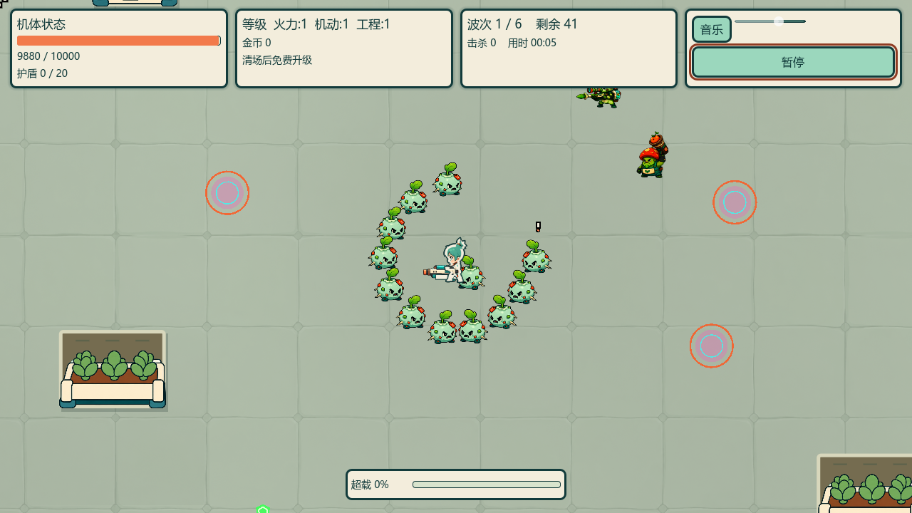

# v12 小怪短预警效果预览

2026-10-09，分支 `5分钟超载`。按人类批准的方案实现，视觉/手感仍为待试玩确认的预览；未发布。

## 直接试玩

本机 `build/playtest/5分钟超载-current-v12/five-minute-overdrive.exe`，同目录PCK必须保留。旧v11保留；不能混用PCK。导出实际退出0，日志无ERROR；包含原有未提交资源，不称干净HEAD构建。

PCK：3026664字节，SHA256 `24d41cc35cdb28889e8b0f061996a56112ec26166e257a7ca40d17d71292ae35`。

## 本轮变化

- 普通小怪预警改为约14px头顶感叹号，黑边、暖白主体、橙色点；只显示出手前状态，隐身目标/死亡不显示。普通近战不再铺地面扇形、圆环或扑击胶囊框。
- 普通贴身前摇0.18秒、恢复0.20秒；抓击前摇0.22秒，扑击0.30秒，新招恢复0.20秒。缩短的时间补到冷却，不另加攻击频率。
- 新招恢复阶段正常执行地图导航和群体追击。扑击维持330px/s、0.30秒与真实碰撞，启动距离收紧到移动长度+接触半径范围；蓄力和出手的朝向跟随锁定方向。
- 吐弹增加0.18秒头顶提示，狙击/投掷前摇0.30/0.35秒。狙击保留最后0.10秒细瞄准线；投掷保留真实落点圈与0.90秒飞行。远程周期通过冷却补偿保留。
- 爪击/普通挥击只用一道3/1.5px描边短弧，扑击一条尾线；投掷落点圈变细，落地特效从六组减为三组。贴身攻击线仍在地面层，因此角色重叠时部分划痕会被遮挡，待真人确认此收敛程度。
- 大型怪与Boss前摇、所有伤害、hitbox、玩家输出与受击反馈不变。暂停说明和玩法指南已更新。

## 验证与边界

新测试在旧代码下真实退出1（普通前摇/恢复与头顶状态缺失）；实现后31断言通过，涵盖预警/出手/恢复/取消、单线预算、不可达扑击、恢复追击、非受伤目标防护，以及30/60/120Hz十秒普通攻击计数。

初次全量回归拒绝通过：更早到达的扑击暴露群体测试无受伤接口目标的调用错误；补齐与原近战一致的接口检查。并发新增诊断脚本的UID未在首次导入时生成，亦被门禁拒绝。保留失败输出，未跳过或放宽错误门。重新导入后全量退出0：86 Godot套件/174507断言，35 Python套件/269测试；日志 `build/diagnostics/compact-enemy/full-green-v1.log`。

实际导出PCK通过外部夹具加载其 `res://` 代码：EnemyCompactAttackTest31、ScrapperAttackTest21，退出0且无错误/泄漏。不是普通EXE完整战斗或通关验收。

原生Vulkan真实Main受控遭遇 `build/diagnostics/compact-enemy/preview-v2/`：900连续帧、每3帧取样，共300张1280×720 PNG；以20fps编码为15秒MP4。前5秒单怪，后10秒追加怪群并通过Input移动玩家。真实地图、群体AI、攻击时序与碰撞运行；诊断手动刷怪、暂停传送门/刷怪导演并提高玩家生命，不能当作自然整局。报告valid=true，512帧有头顶预警、401帧有攻击状态，真实伤害10000→9475；已目检头顶、单怪与密集帧。

预览录像：`build/diagnostics/compact-enemy/preview-v2/compact-enemy-preview.mp4`。截图见下。

代码自审：完成相关行为、保留伤害边界、无新依赖/网络/每帧新增节点；未合并原有无关脏资源。自动测试不能代签手感，下一步仅根据玩家试玩反馈继续微调。
