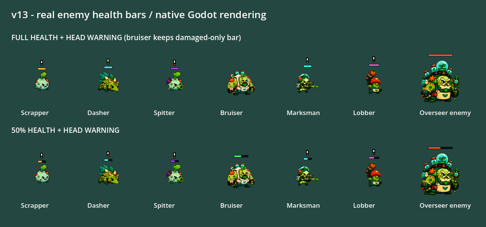

# v13 小怪血量条

2026-10-09，分支 `5分钟超载`；本机预览，未公开发布。

## 直接试玩

`build/playtest/5分钟超载-current-v13/five-minute-overdrive.exe`，保留同目录PCK。旧v12不覆盖。当前工作树含原有未提交资源，不能称干净HEAD构建。

PCK：3026632字节，SHA256 `1f90955bbb02ef3c4a6fe18301ba5a0dbdee3a95892d2383487072628027abb9`。导出退出0，日志无ERROR/SCRIPT ERROR/WARNING。

## 行为与布局

- 追击者、疾冲者、喷吐者、狙击手、投弹手：存活时常驻血条，满血也显示，填充比例来自实际HealthComponent。死亡或尚无血量组件不显示。
- 沿用已有大型敌人血条的黑色底框、6px高度和敌怪强调色，不增加数字、闪烁或新UI节点。
- 头顶感叹号与血条保持至少4px间距，不改变预警时间、攻击频率、伤害或碰撞。
- 重装者受伤后才显示血条的原规则保留；Overseer敌人常驻血条、真正Boss的HUD不变。

## 验证

先改测试，在旧实现下EnemyStaticArtTest与新增EnemyHealthBarTest真实失败；实现后新增测试84断言通过，覆盖七类敌人满血/受伤/恢复/死亡/无组件、比例、无贴图回退与标记间距。

完整严格回归退出0：87 Godot套件、174592断言；35 Python套件、269测试。日志：`build/diagnostics/enemy-health-bars/full-green-v1.log`。相关静态美术108、短预警31、Boss血条47、疾冲者美术14断言亦通过。

外部夹具加载实际导出PCK：血条84、短预警31、Boss血条47断言通过，共162。尝试旧EnemyStaticArtTest的PCK验证时，其FileAccess原始PNG存在检查失败：打包资源使用导入重映射，不能用此源文件存在检查证明运行贴图缺失。没有放宽测试，也不计为PCK通过；源码该套件通过。

原生Vulkan渲染真实Enemy类的七类满血/半血图，摆拍冻结AI并主动设置预警状态，用于检查画布、血条和感叹号排布，不是自然整局或真人手感验收。画面已目检；图中Overseer为Enemy枚举类型，不冒称最终Boss完整战斗。

代码自审：沿用已有绘制与血量组件，无新依赖、无网络、无每帧新增节点；修改范围仅血条与预警排布，未纳入原有无关脏文件。未开展骨骼替换或MCP安装；相关[可行性评估](enemy-skeletal-animation-assessment-v1.md)是建议，不是完成声明。
